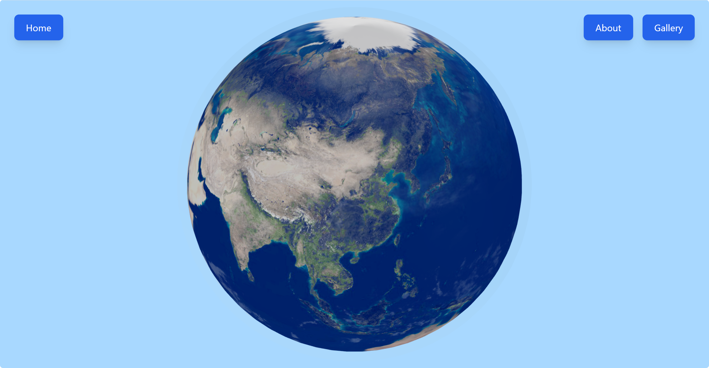

<div align="center">
  
  <h1>Campus Demo</h1>
  <p>
    <a href="#english">English</a> | <a href="#chinese">中文</a>
  </p>
  <p>
    
    
    
    
  </p>
  <p>An interactive web application showcasing campus information 🎓</p>
  <p>一个展示校园相关信息的交互式 Web 应用程序</p>
</div>

---

<a id="english"></a>
# 🌍 English

## 📸 Demo

<div align="center">
  <p>
    <b>Watch the Demo:</b> <a href="./public/assets/demo-2025-3d_Earth.mp4" download></a>
  </p>
</div>

## ✨ Features

- 🏫 **Campus Selection**: Interactive selection of different campuses with detailed information
- 🗺️ **Campus Map**: Rich visualization of social club locations and landmark buildings with multiple map modes
- 📸 **Photo Sharing**: Community-driven photo uploads and campus story sharing
- 📋 **Information Hub**: Comprehensive project information, vision, and content showcase

## 🛠️ Tech Stack

<div align="center">

| Category | Technologies |
|----------|-------------|
| Frontend | React, TypeScript, Tailwind CSS, Leaflet |
| Build Tool | Vite |

</div>

## 🚀 Getting Started

### Prerequisites

- Node.js (v14 or higher) 📦
- npm or yarn 📥

### Quick Start

1. **Clone the repository**
   ```bash
   git clone https://github.com/Tully-L/0703-demo-campus.git
   cd 0703-demo-campus
   ```

2. **Install dependencies**
   ```bash
   npm install
   # or
   yarn install
   ```

3. **Start development server**
   ```bash
   npm run dev
   # or
   yarn dev
   ```
   Access at `http://localhost:5173`

4. **Build for production**
   ```bash
   npm run build
   # or
   yarn build
   ```

## 📁 Project Structure

```
0703-demo-campus/
├── public/                 # Static assets
│   └── gallery/           # Media files
├── src/                   # Source code
│   ├── components/       # React components
│   ├── data/            # Data files
│   ├── pages/           # Page components
│   ├── utils/           # Utility functions
│   └── App.tsx          # Root component
└── [Configuration files] # Various config files
```

## 📖 Usage Guide

### 🌏 Home Page
Interactive Earth visualization with campus selection dropdown. Select a campus to explore detailed information.

### 🗺️ Map Page
- Multiple map modes (satellite, topographic, road)
- Zoom and pan controls
- Location markers with detailed information
- Social club activity spots and landmarks

### 📋 About Page
Project information, vision statement, and photo upload functionality.

### 📸 Gallery Page
Community-shared photos and videos showcase.

## 🤝 Contributing

1. Fork the repository
2. Create feature branch: `git checkout -b feature/amazing-feature`
3. Commit changes: `git commit -m 'Add amazing feature'`
4. Push to branch: `git push origin feature/amazing-feature`
5. Open a Pull Request

## 📄 License

ISC License - See [LICENSE](LICENSE) for details

## 📧 Contact

- Email: ecofairuwc@gmail.com

---

<a id="chinese"></a>
# 🌍 中文

## 📸 演示

<div align="center">
  <p>
    <b>观看演示:</b> <a href="./public/assets/demo-2025-3d_Earth.mp4" download></a>
  </p>
</div>

## ✨ 功能特性

- 🏫 **校区选择**：支持选择不同的校区，查看详细信息
- 🗺️ **校园地图**：展示社交俱乐部活动地点、地标建筑等信息
- 📸 **照片分享**：用户上传照片和分享校园故事
- 📋 **信息展示**：项目目的、愿景、内容介绍

## 🛠️ 技术栈

<div align="center">

| 类别 | 技术 |
|------|------|
| 前端 | React, TypeScript, Tailwind CSS, Leaflet |
| 构建工具 | Vite |

</div>

## 🚀 快速开始

### 环境要求

- Node.js (v14 或更高版本) 📦
- npm 或 yarn 📥

### 安装步骤

1. **克隆仓库**
   ```bash
   git clone https://github.com/Tully-L/0703-demo-campus.git
   cd 0703-demo-campus
   ```

2. **安装依赖**
   ```bash
   npm install
   # 或
   yarn install
   ```

3. **启动开发服务器**
   ```bash
   npm run dev
   # 或
   yarn dev
   ```
   访问 `http://localhost:5173`

4. **构建生产版本**
   ```bash
   npm run build
   # 或
   yarn build
   ```

## 📁 项目结构

```
0703-demo-campus/
├── public/                # 静态资源
│   └── gallery/          # 媒体文件
├── src/                  # 源代码
│   ├── components/      # React 组件
│   ├── data/           # 数据文件
│   ├── pages/          # 页面组件
│   ├── utils/          # 工具函数
│   └── App.tsx         # 根组件
└── [配置文件]           # 各种配置文件
```

## 📖 使用指南

### 🌏 首页
交互式地球可视化组件，包含校区选择功能。

### 🗺️ 地图页面
- 多种地图模式（卫星图、地形图、路线图）
- 缩放和平移控制
- 位置标记和详细信息
- 社交俱乐部活动点和地标

### 📋 关于页面
项目信息、愿景陈述和照片上传功能。

### 📸 照片分享页面
社区共享的照片和视频展示。

## 🤝 贡献指南

1. Fork 仓库
2. 创建特性分支：`git checkout -b feature/amazing-feature`
3. 提交更改：`git commit -m '添加精彩特性'`
4. 推送分支：`git push origin feature/amazing-feature`
5. 提交 Pull Request

## 📄 许可证

ISC 许可证 - 查看 [LICENSE](LICENSE) 了解详情

